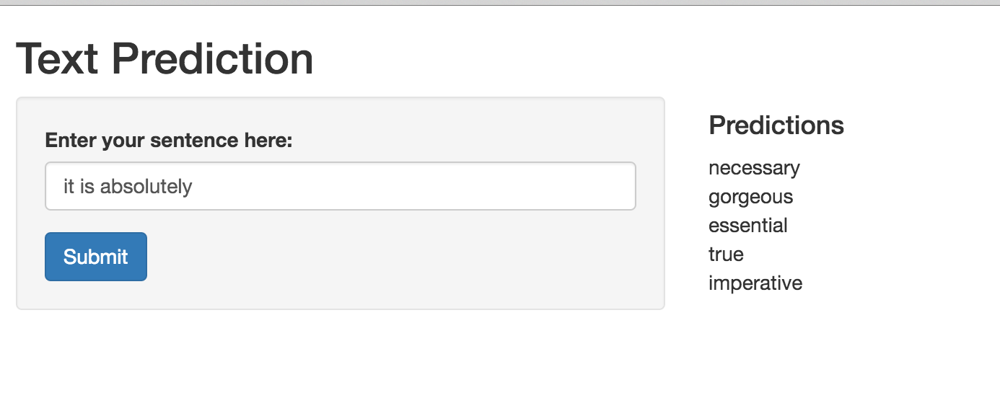

Text Prediction Project
========================================================
author: Laura Li
date: 04/12/2016
autosize: true

Summary & Exploratory Data Analysis
========================================================

* Purpose of this project is to build an app that would predcit the next word following the user entered phrase
* Data is a raw text extract from blogs, news and twitter 
* To begin the raw data provided to build a model after needed to be explored to 
* The following is the initial summary of information for the three files provided.

|               | Lines Count   | Word Count      |
|---------------|---------------|-----------------|
|Blogs|899,288|39,120,549|
|News|1,010,242|36,721,087|
|Twitter|2,360,148|32,793,399|

Prediction Model
========================================================
* My initial model was to build Ngrams tables up to 4-grams
* Model was planned to take the last words of the user entered phrase
* Then try to match them to the table then taking the last word in the Ngram apropriately
* If no match were found it will then drop down a word from the front of the last user entered phrase and match to the proceeding Ngram table
  + <strong>Example:</strong>
      - *User Enters:* "because you mean the"
      - "you mean the"=3 word to match to the beginning of 4-gram 

Refining Model
========================================================
1. After various test to measure accuracy vs processing speed 70% of the training data was sampled.
2. The 3 data were combined and cleaned of all symbols that were not english. (ie. emojis, $#!@%^)
3. The completed matrix was trimmed with any frequency occurency less than 2.
4. Then the english stopwords (ie. and, i'd, can) and word with less than 3 characters in the last word of the matrix were removed from table. 
5. Also during testing of the model relative term match along with exact match term were incoporated into the final results.
6. Finally partial match of the phrase to the Ngram table was incoporated to provide further accuracy.

Shiny App Description
========================================================
The [shiny product](https://sourpeach.shinyapps.io/TextPredictionShiny/) is a simple design. The left hand text box will take user input in phrases and click the submit button. The prediction will produce the 5 most likely outcome outputted to the left.

